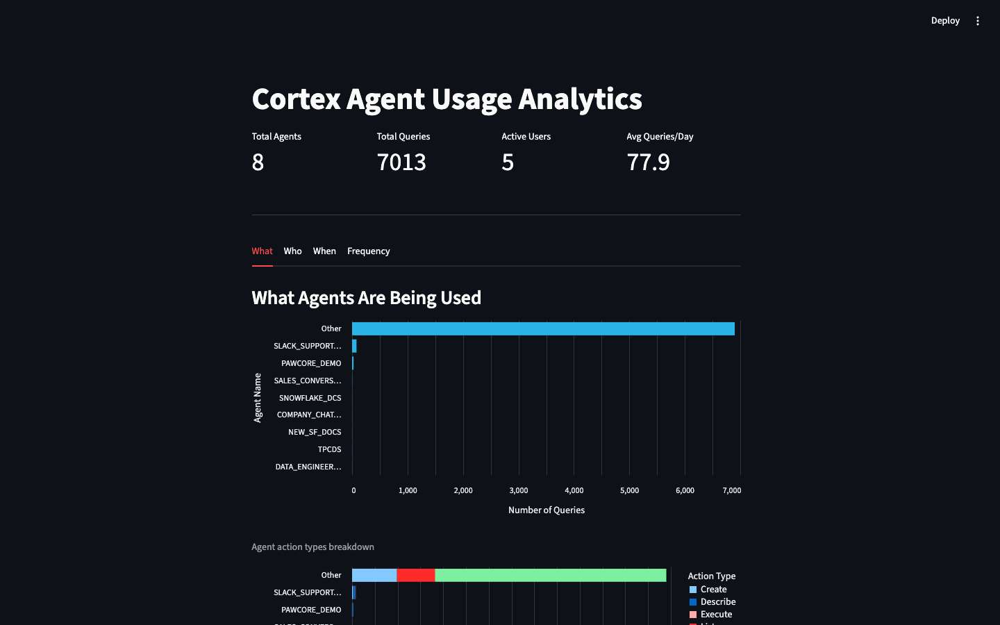
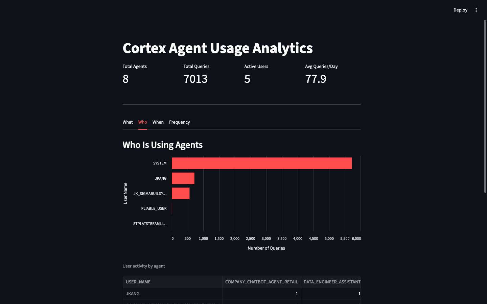
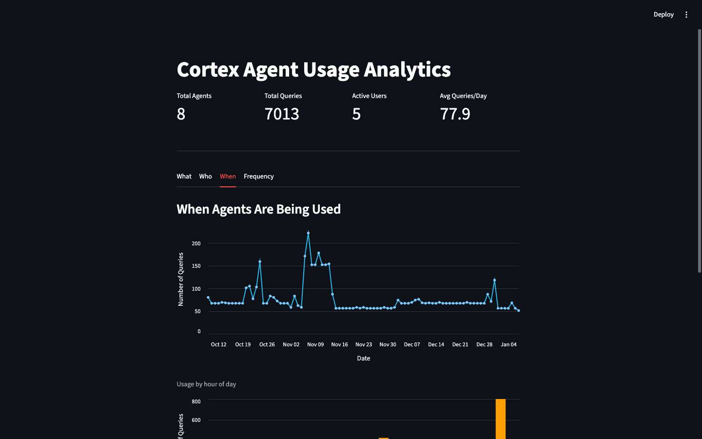
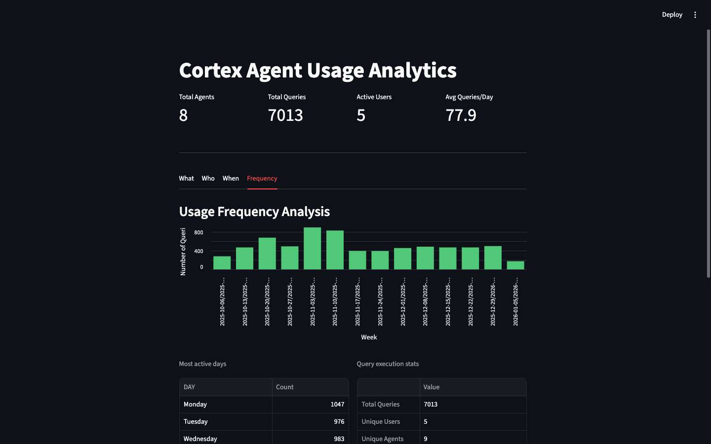

# Cortex Agent Usage Analytics Dashboard

A Streamlit in Snowflake application that provides comprehensive analytics on Cortex Agent usage across your Snowflake account. Track **what** agents are being used, **who** is using them, **when** they're being used, and **how often**.

## Screenshots

### What - Agent Usage Overview

*View all registered agents and their operation breakdown by action type*

### Who - User Activity

*See which users are interacting with agents and their activity patterns*

### When - Temporal Analysis

*Analyze usage trends over time with daily timeline and hourly distribution*

### Frequency - Usage Patterns

*Understand weekly patterns and execution statistics*

## Features

- **What**: View all registered agents and their operation types (Create, Modify, Execute, etc.)
- **Who**: See which users are interacting with agents and their activity patterns
- **When**: Analyze usage trends over time, by hour of day, and day of week
- **Frequency**: Understand usage patterns with daily averages and execution statistics

## Architecture

```
┌─────────────────────────────────────────────────────────────────────┐
│                     Streamlit in Snowflake                          │
│                    (Container Runtime)                              │
├─────────────────────────────────────────────────────────────────────┤
│                                                                     │
│  ┌──────────────┐    ┌──────────────┐    ┌──────────────┐          │
│  │   What Tab   │    │   Who Tab    │    │  When Tab    │          │
│  │              │    │              │    │              │          │
│  │ Agent List   │    │ User Stats   │    │ Time Series  │          │
│  │ Action Types │    │ User-Agent   │    │ Hourly Dist  │          │
│  │ Operations   │    │   Matrix     │    │ Day of Week  │          │
│  └──────────────┘    └──────────────┘    └──────────────┘          │
│                                                                     │
│  ┌──────────────┐                                                   │
│  │ Frequency    │    ┌─────────────────────────────────────────┐   │
│  │    Tab       │    │         Data Sources                    │   │
│  │              │    │                                         │   │
│  │ Weekly Stats │    │  • SHOW AGENTS IN ACCOUNT               │   │
│  │ Exec Stats   │    │  • SNOWFLAKE.ACCOUNT_USAGE.QUERY_HISTORY│   │
│  └──────────────┘    └─────────────────────────────────────────┘   │
│                                                                     │
└─────────────────────────────────────────────────────────────────────┘
         │                              │
         ▼                              ▼
┌─────────────────┐          ┌─────────────────────┐
│  Compute Pool   │          │   Query Warehouse   │
│ (App Execution) │          │  (SQL Execution)    │
└─────────────────┘          └─────────────────────┘
```

## Tech Stack

| Component | Technology |
|-----------|------------|
| Frontend | Streamlit 1.51+ |
| Runtime | Snowflake Container Runtime (Python 3.11) |
| Package Manager | UV with pyproject.toml |
| Data Visualization | Altair 5.5+ |
| Data Processing | Pandas 2.3+ |
| Snowflake Connector | snowflake-snowpark-python 1.37+ |

## Deployment

### Prerequisites

1. Snowflake account with:
   - `ACCOUNTADMIN` role (or appropriate privileges)
   - Access to `SNOWFLAKE.ACCOUNT_USAGE.QUERY_HISTORY`
   - A compute pool for container runtime
   - An External Access Integration (EAI) for PyPI

2. A stage to store the app files

### Deploy to Snowflake

```sql
-- 1. Create a stage for the app
CREATE STAGE IF NOT EXISTS MY_DB.MY_SCHEMA.AGENT_USAGE_STAGE
  DIRECTORY = (ENABLE = TRUE);

-- 2. Upload files (using Snowflake CLI)
-- snow stage copy pyproject.toml @MY_DB.MY_SCHEMA.AGENT_USAGE_STAGE --overwrite
-- snow stage copy streamlit_app.py @MY_DB.MY_SCHEMA.AGENT_USAGE_STAGE --overwrite

-- 3. Create the Streamlit app with container runtime
CREATE OR REPLACE STREAMLIT MY_DB.MY_SCHEMA.AGENT_USAGE_DASHBOARD
  FROM '@MY_DB.MY_SCHEMA.AGENT_USAGE_STAGE'
  MAIN_FILE = 'streamlit_app.py'
  RUNTIME_NAME = 'SYSTEM$ST_CONTAINER_RUNTIME_PY3_11'
  COMPUTE_POOL = MY_COMPUTE_POOL
  QUERY_WAREHOUSE = MY_WAREHOUSE
  EXTERNAL_ACCESS_INTEGRATIONS = (MY_PYPI_EAI)
  TITLE = 'Cortex Agent Usage Analytics';

-- 4. Initialize the live version
ALTER STREAMLIT MY_DB.MY_SCHEMA.AGENT_USAGE_DASHBOARD ADD LIVE VERSION FROM LAST;
```

### Creating an EAI for PyPI (if needed)

```sql
-- Create network rule for PyPI access
CREATE OR REPLACE NETWORK RULE PYPI_NETWORK_RULE
  MODE = EGRESS
  TYPE = HOST_PORT
  VALUE_LIST = ('pypi.org', 'pypi.python.org', 'pythonhosted.org', 'files.pythonhosted.org');

-- Create external access integration
CREATE OR REPLACE EXTERNAL ACCESS INTEGRATION PYPI_ACCESS_INTEGRATION
  ALLOWED_NETWORK_RULES = (PYPI_NETWORK_RULE)
  ENABLED = true;
```

## Challenges Faced & Solutions

### 1. No Dedicated Agent Usage View

**Challenge**: Snowflake doesn't have a dedicated `CORTEX_AGENT_USAGE_HISTORY` view for tracking agent interactions.

**Solution**: Query `SNOWFLAKE.ACCOUNT_USAGE.QUERY_HISTORY` with pattern matching on query text:
```sql
WHERE (
    QUERY_TEXT ILIKE '%SNOWFLAKE_INTELLIGENCE.AGENTS%' 
    OR QUERY_TEXT ILIKE '%COMPLETE_AGENT%'
    OR QUERY_TEXT ILIKE '%RUN AGENT%'
    OR QUERY_TEXT ILIKE '%CREATE%AGENT%'
    -- etc.
)
```

### 2. False Positives in Query Matching

**Challenge**: Some queries containing "Agent" (like DataOps pipelines) were incorrectly included.

**Solution**: Added exclusion filters:
```sql
AND QUERY_TEXT NOT ILIKE '%DataOps_Pipeline%'
```

### 3. Agent Name Extraction

**Challenge**: Agent names aren't stored in a structured field in query history.

**Solution**: Created a pattern-matching function that identifies known agent names from query text and categorizes unknown patterns.

### 4. Warehouse vs Container Runtime Confusion

**Challenge**: Initial deployment used warehouse runtime with `QUERY_WAREHOUSE`, but requirement was for SPCS/container runtime with UV package management.

**Solution**: 
- Changed from `environment.yml` (conda) to `pyproject.toml` (UV)
- Used `RUNTIME_NAME = 'SYSTEM$ST_CONTAINER_RUNTIME_PY3_11'`
- Added `COMPUTE_POOL` parameter
- Required `EXTERNAL_ACCESS_INTEGRATIONS` for PyPI package installation

### 5. Legacy vs Modern CREATE STREAMLIT Syntax

**Challenge**: Old `ROOT_LOCATION` syntax doesn't support container runtime features.

**Solution**: Used modern `FROM` syntax:
```sql
-- Modern (supports container runtime)
CREATE STREAMLIT app FROM '@stage' MAIN_FILE = 'app.py' RUNTIME_NAME = '...'

-- Legacy (warehouse only)
CREATE STREAMLIT app ROOT_LOCATION = '@stage' MAIN_FILE = 'app.py'
```

### 6. App Initialization Required

**Challenge**: After `CREATE STREAMLIT`, the app wasn't accessible.

**Solution**: Must run:
```sql
ALTER STREAMLIT app ADD LIVE VERSION FROM LAST;
```

## Project Structure

```
agent_usage_dashboard/
├── streamlit_app.py      # Main Streamlit application
├── pyproject.toml        # UV dependency management
├── uv.lock               # Locked dependency versions
├── .gitignore
└── README.md
```

## Data Flow

```
┌─────────────────────┐     ┌─────────────────────┐
│   SHOW AGENTS IN    │     │  QUERY_HISTORY      │
│      ACCOUNT        │     │  (90 days)          │
└──────────┬──────────┘     └──────────┬──────────┘
           │                           │
           ▼                           ▼
┌─────────────────────┐     ┌─────────────────────┐
│  Agent Metadata:    │     │  Usage Data:        │
│  - Name             │     │  - User             │
│  - Owner            │     │  - Query Text       │
│  - Created Date     │     │  - Timestamp        │
│  - Description      │     │  - Status           │
└──────────┬──────────┘     └──────────┬──────────┘
           │                           │
           └───────────┬───────────────┘
                       ▼
              ┌─────────────────┐
              │   Processing:   │
              │  - Extract      │
              │    Agent Names  │
              │  - Categorize   │
              │    Actions      │
              │  - Aggregate    │
              │    Statistics   │
              └────────┬────────┘
                       ▼
              ┌─────────────────┐
              │  Visualization  │
              │  (4 Tabs)       │
              └─────────────────┘
```

## Key Metrics Displayed

| Metric | Description |
|--------|-------------|
| Total Agents | Count of registered agents in account |
| Total Operations | Number of agent-related queries |
| Active Users | Unique users interacting with agents |
| Avg Queries/Day | Daily average of agent operations |

## Contributing

1. Fork the repository
2. Create a feature branch
3. Make your changes
4. Test locally with `streamlit run streamlit_app.py`
5. Submit a pull request

## License

MIT License - feel free to use and modify for your own Snowflake account analytics.

---

Built with Cortex Code for Snowflake
